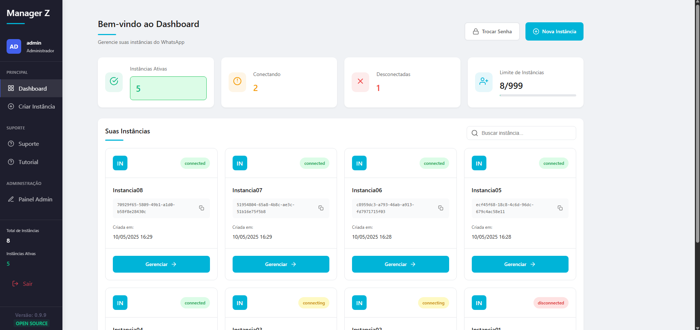

# Manager Z Open Source

<div align="center">
  
  <h3>Gerencie suas instâncias de API do WhatsApp com facilidade</h3>
</div>

---

## 🚀 Sobre o Projeto

Manager Z é um sistema de gerenciamento de APIs de WhatsApp open source, projetado para facilitar a administração e configuração de múltiplas instâncias de API em um único lugar. Desenvolvido com PHP e JavaScript, oferece uma solução robusta para empresas e desenvolvedores que precisam gerenciar várias conexões de API do WhatsApp com segurança e eficiência.

<div align="center">
  
  <p><i>Visão geral da interface do aplicativo</i></p>
</div>

---

## ✨ Funcionalidades

### Já Implementadas

✅ Gerenciamento de instâncias: Crie, configure e monitore várias instâncias de API do WhatsApp  
✅ Autenticação segura: Sistema de login com múltiplos níveis de acesso e autenticação de dois fatores  
✅ Painel administrativo: Interface intuitiva para gerenciar todas as configurações e instâncias  
✅ Registros de atividade: Logs detalhados para auditoria e rastreamento de uso  
✅ Configurações personalizáveis: Adapte cada instância às necessidades específicas  

### Em Desenvolvimento

🔨 Integração com CRMs: Conectores para sistemas populares de CRM e ERP  
🔨 API própria: Endpoints para integrar o Manager Z com outros sistemas  
🔨 Análise avançada: Métricas e estatísticas de uso e desempenho  
🔨 Templates de mensagens: Biblioteca de modelos para comunicação rápida  

---

## 🛠️ Tecnologias Utilizadas

- **Backend:** PHP 8.2+
- **Frontend:** HTML5, CSS3, JavaScript, Bootstrap 5
- **Banco de Dados:** MySQL 5.7+
- **Gerenciador de Dependências:** Composer
- **Segurança:** JWT para autenticação, CSRF proteção, Sanitização de dados
- **Comunicação:** WebSockets para atualizações em tempo real

---

## 📂 Estrutura do Projeto

Abaixo está a estrutura atualizada do projeto para facilitar a navegação:

```
img_git/
├── dashboard.png       # Imagem do dashboard
├── logo-managerz.png   # Logotipo do Manager Z
├── qrcode-pix.png      # QR Code para doações
public/
├── base.php            # Arquivo base da aplicação
├── config.php          # Configurações gerais
├── criar_instancia.php # Criação de instâncias
├── dashboard.php       # Página principal do dashboard
├── favicon.ico         # Ícone do site
├── footer.php          # Rodapé compartilhado
├── forgot-password.php # Recuperação de senha
├── index.php           # Página inicial
├── login.php           # Página de login
├── logout.php          # Logout do sistema
├── sidebar.php         # Barra lateral
├── testebanco.php      # Teste de conexão com o banco
├── trocar_senha.php    # Troca de senha
├── admin/              # Diretório de administração
│   ├── admin.php       # Painel administrativo
│   ├── admin_add_user.php # Adicionar usuários
│   ├── admin_chatwoot.php # Integração com Chatwoot
│   ├── admin_config_avancadas.php # Configurações avançadas
│   ├── admin_delete_instance.php # Deletar instâncias
│   ├── admin_delete_user.php # Deletar usuários
│   ├── admin_instancia.php # Gerenciamento de instâncias
│   ├── admin_user.php # Gerenciamento de usuários
│   └── css/           # Estilos do painel administrativo
├── ajax/               # Scripts AJAX
│   ├── check_connection.php # Verificar conexão
│   ├── disconnect_instance.php # Desconectar instância
│   ├── get_qrcode.php  # Obter QR Code
│   └── sync_settings.php # Sincronizar configurações
├── assets/             # Recursos estáticos
│   ├── css/            # Arquivos CSS
│   ├── img/            # Imagens
│   └── js/             # Scripts JavaScript
├── logs/               # Logs do sistema
│   └── api.log         # Logs de API
├── tutorial/           # Gerenciamento de tutoriais
│   ├── add_tutorial.php # Adicionar tutoriais
│   ├── delete_tutorial.php # Deletar tutoriais
│   ├── edit_tutorial.php # Editar tutoriais
│   └── list_tutoriais.php # Listar tutoriais
└── webhook/            # Configurações de webhook
    ├── webhook_config.php # Configuração de webhook
    └── assets/         # Recursos do webhook
        └── webhook_config.css # Estilos do webhook
src/
├── Api.php             # Classe principal para integração com APIs
├── Logger.php          # Classe para gerenciamento de logs
├── Security.php        # Classe para funcionalidades de segurança
└── Session.php         # Classe para gerenciamento de sessões
```

---

## 🚀 Instalação e Uso

### Pré-requisitos

- PHP 8.2 ou superior
- Servidor web (Apache ou Nginx)
- MySQL 5.7 ou superior
- Composer (para gerenciar dependências PHP)

### Passo a Passo

1. **Clone o repositório:**
   ```bash
   git clone https://github.com/cadao7/managerz-opensource.git
   cd managerz-opensource
   ```

2. **Configure o ambiente:**
   - Copie o arquivo `.env.exemple` para `.env`:
     ```bash
     cp .env.exemple .env
     ```
   - Edite o arquivo `.env` com as configurações do seu ambiente.

3. **Instale as dependências:**
   ```bash
   composer install
   ```

4. **Configure o banco de dados:**
   - Acesse o MySQL como root:
     ```bash
     mysql -u root -p
     ```
   - Crie o banco de dados:
     ```sql
     CREATE DATABASE manager_z;
     ```
   - Conceda permissões ao usuário:
     ```sql
     GRANT ALL PRIVILEGES ON manager_z.* TO 'seu_usuario'@'localhost' IDENTIFIED BY 'sua_senha';
     FLUSH PRIVILEGES;
     ```
   - Importe o arquivo SQL:
     ```bash
     mysql -u seu_usuario -p manager_z < banco.sql
     ```

5. **Inicie o servidor local:**
   ```bash
   php -S localhost:8000 -t public
   ```

6. **Acesse a aplicação:**
   Abra o navegador e acesse `http://localhost:8000`.

---

## 🏆 Manager Z PRO

Além da versão open source, oferecemos o **Manager Z PRO**, uma solução premium com funcionalidades avançadas para atender às necessidades mais exigentes de empresas e desenvolvedores. Confira abaixo as diferenças entre as versões:

| Funcionalidade                                    | Open Source | PRO |
| ------------------------------------------------- | :---------: | :-: |
| 🚻 Dashboard para gerenciamento de instâncias      |      ✅     |  ✅  |
| 📁 SaaS - Criação de contas com 1 única API        |      ✅     |  ✅  |
| 📁 SaaS - Criação de múltiplas contas de usuários  |      ❌     |  ✅  |
| 🔄 Múltiplas sessões                               |      ✅     |  ✅  |
| ⏩ Encaminhamento de mensagens                     |      ✅     |  ✅  |
| 📥 Recebimento de mensagens                        |      ✅     |  ✅  |
| 👤 Múltiplas APIs                                  |      ❌     |  ✅  |
| 📍 Compartilhamento de API                         |      ❌     |  ✅  |
| 🤖 TypeBot                                         |      ❌     |  ✅  |
| 💬 Chats                                           |      ❌     |  ✅  |
| 🛟 Área de Suporte                                 |      ❌     |  ✅  |
| 🎫 Tickets                                         |      ❌     |  ✅  |
| ⚙️ Configurações avançadas                         |      ❌     |  ✅  |
| 🔢 Limite de Conexão Por API                       |      ❌     |  ✅  |
| ⭐ Prioridade de Uso de API                        |      ❌     |  ✅  |
| 🚦 Status de API (Ativo, Parcial, Manutenção)      |      ❌     |  ✅  |
| 🔑 Permitir Cliente Criar suas API                 |      ❌     |  ✅  |
| 📚 Área de tutorial mais completa                  |      ❌     |  ✅  |
| 👥 Gerenciamento de usuários                       |      ❌     |  ✅  |
| 📌 Envio de localização                            |      ❌     |  ✅  |

Para saber mais sobre o **Manager Z PRO**, entre em contato conosco pelo email [contato@sonho.digital](mailto:contato@sonho.digital) ou visite nosso site [managerz.sonho.digital](https://managerz.sonho.digital).

---

## 📚 Documentação

Para mais detalhes sobre as funcionalidades e API do projeto, consulte nossa documentação completa.

---

## 🌐 Links de Comunidade

Junte-se à nossa comunidade para trocar ideias, tirar dúvidas e colaborar com outros usuários do Manager Z:

- **Grupo do WhatsApp:** [Clique aqui para entrar](https://chat.whatsapp.com/DQ034vaXuue6aqyiYlCpwb)
- **Servidor do Discord:** [Clique aqui para entrar](https://discord.gg/XBHXjE8XP5)

---

## 🤝 Como Contribuir

Contribuições são sempre bem-vindas! Siga os passos abaixo:

1. Faça um fork do projeto.
2. Crie uma branch para sua feature:  
   ```bash
   git checkout -b feature/nova-funcionalidade
   ```
3. Faça commit das alterações:  
   ```bash
   git commit -m 'Adiciona nova funcionalidade'
   ```
4. Envie para o repositório:  
   ```bash
   git push origin feature/nova-funcionalidade
   ```
5. Abra um Pull Request explicando suas alterações.

---

## 💰 Apoie o Projeto

Se você gostou deste projeto e deseja contribuir financeiramente para o seu desenvolvimento, considere fazer uma doação:

<div align="center">
  
  <p><b>Chave PIX:</b> ricardo.maminhak@gmail.com</p>
  <p><i>Sua contribuição ajuda a manter o Manager Z ativo e a desenvolver novas funcionalidades! Todo valor contribuído será usado para manter a infraestrutura, documentação e adicionar novos recursos.</i></p>
</div>

---

## 📄 Licença

Este projeto está disponível sob uma licença personalizada que combina elementos de open source com proteção da marca. Veja o arquivo LICENSE para detalhes completos.

**Resumo da Licença:**

✅ Uso comercial: Permitido, com certas condições  
✅ Modificação: Permitida para o código-fonte  
✅ Distribuição: Permitida com atribuição obrigatória  
❌ Uso da marca e logo: Protegidos e requerem permissão  
❌ Remoção de atribuições: Não permitida  

A licença permite que o código seja usado livremente, inclusive para fins comerciais, mas protege a marca "Manager Z" e exige atribuição adequada.

---

## 📬 Contato

- **Empresa:** Sonho Digital LTDA  
- **Email:** ricardo.maminhak@gmail.com  
- **GitHub:** [@sonhodigital](https://github.com/sonho-digital)  
- **Site:** [managerz.sonho.digital](https://managerz.sonho.digital)  
- **Site Sonho Digital:** [Sonho Digital](https://sonho.digital)

<div align="center">
  <p>Feito com ❤️ no Brasil</p>
</div>
